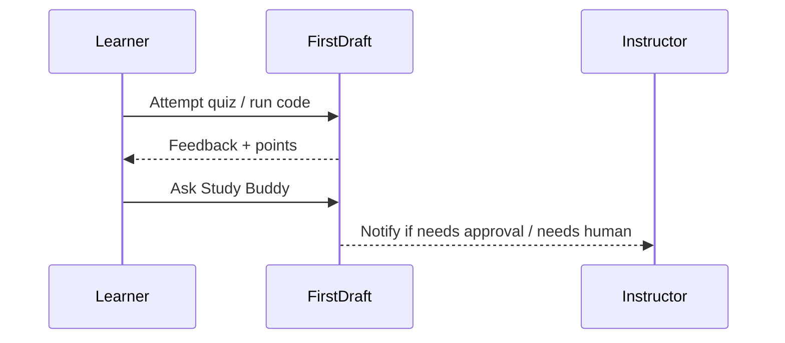
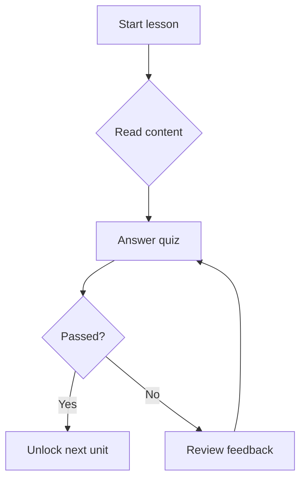

# Complete Example Lesson

This lesson is a kitchen-sink reference for every authoring feature available on the First Draft platform. Each section shows a rendered example and links to the raw Markdown source that produced it.

For a deeper explanation of each feature, see the [Platform Overview](/lessons/799-platform-overview).

---

## Standard Markdown

### Headings

The heading above and all section headings in this lesson are standard Markdown headings (`##`, `###`, etc.). [View source](https://github.com/appdev-lessons/complete-example-lesson/blob/84ffebc06ffd6dccb055d2b734c3f5a07b7c20d8/content.md?plain=1#L9-L11)

### Text formatting

Here is **bold text**, *italic text*, ***bold and italic***, `inline code`, and ~~strikethrough~~. [View source](https://github.com/appdev-lessons/complete-example-lesson/blob/84ffebc06ffd6dccb055d2b734c3f5a07b7c20d8/content.md?plain=1#L17-L17)

### Unordered list

- First item
- Second item
  - Nested item
  - Another nested item
- Third item

[View source](https://github.com/appdev-lessons/complete-example-lesson/blob/84ffebc06ffd6dccb055d2b734c3f5a07b7c20d8/content.md?plain=1#L21-L25)

### Ordered list

1. First step
1. Second step
   1. Sub-step A
   1. Sub-step B
1. Third step

[View source](https://github.com/appdev-lessons/complete-example-lesson/blob/84ffebc06ffd6dccb055d2b734c3f5a07b7c20d8/content.md?plain=1#L31-L35)

### Standard table

| Language | Typing | Year |
|---|---|---|
| Ruby | Dynamic | 1995 |
| Python | Dynamic | 1991 |
| Java | Static | 1995 |
| Rust | Static | 2010 |

[View source](https://github.com/appdev-lessons/complete-example-lesson/blob/84ffebc06ffd6dccb055d2b734c3f5a07b7c20d8/content.md?plain=1#L41-L46)

### Horizontal rule

A horizontal rule separates these paragraphs:

---

And here we continue after the rule. [View source](https://github.com/appdev-lessons/complete-example-lesson/blob/84ffebc06ffd6dccb055d2b734c3f5a07b7c20d8/content.md?plain=1#L52-L54)

### Standard fenced code block

```ruby
class Greeter
  def hello(name)
    "Hello, #{name}!"
  end
end
```

[View source](https://github.com/appdev-lessons/complete-example-lesson/blob/84ffebc06ffd6dccb055d2b734c3f5a07b7c20d8/content.md?plain=1#L60-L66)

### Footnotes

Markdown supports footnotes for supplementary detail[^1].

[^1]: This is a footnote. It appears at the bottom of the lesson and keeps the main text clean.

[View source](https://github.com/appdev-lessons/complete-example-lesson/blob/84ffebc06ffd6dccb055d2b734c3f5a07b7c20d8/content.md?plain=1#L72-L74)

---

## Links

### Default behavior (opens in new tab)

[Visit the Markdown Guide](https://www.markdownguide.org/) — this opens in a new tab by default so learners don't lose their place. [View source](https://github.com/appdev-lessons/complete-example-lesson/blob/84ffebc06ffd6dccb055d2b734c3f5a07b7c20d8/content.md?plain=1#L84-L84)

### Same-tab link

[Jump to the Quiz section](#quiz-questions){: target="_self" } — this navigates within the same tab. [View source](https://github.com/appdev-lessons/complete-example-lesson/blob/84ffebc06ffd6dccb055d2b734c3f5a07b7c20d8/content.md?plain=1#L88-L88)

---

## Images

### Standard image


[View source](https://github.com/appdev-lessons/complete-example-lesson/blob/84ffebc06ffd6dccb055d2b734c3f5a07b7c20d8/content.md?plain=1#L96-L96)

### Full-width image


{: .bleed-full }

[View source](https://github.com/appdev-lessons/complete-example-lesson/blob/84ffebc06ffd6dccb055d2b734c3f5a07b7c20d8/content.md?plain=1#L102-L103)

---

## Raw HTML

You can drop into raw HTML anywhere. Here is an embedded `<details>` element:

<details>
<summary>Click to expand</summary>

This content is hidden until the learner clicks. You can include **Markdown** inside raw HTML elements — just omit initial indentation.

- Item one
- Item two
</details>

[View source](https://github.com/appdev-lessons/complete-example-lesson/blob/84ffebc06ffd6dccb055d2b734c3f5a07b7c20d8/content.md?plain=1#L113-L120)

---

## Bootstrap styling

Bootstrap classes can be attached to any element using `{: class="..." }`.

### Alert boxes

This is a primary alert.
{: class="alert alert-primary" }

This is a success alert.
{: class="alert alert-success" }

This is a warning alert.
{: class="alert alert-warning" }

This is a danger alert.
{: class="alert alert-danger" }

This is an info alert.
{: class="alert alert-info" }

[View source](https://github.com/appdev-lessons/complete-example-lesson/blob/84ffebc06ffd6dccb055d2b734c3f5a07b7c20d8/content.md?plain=1#L132-L145)

### Alert with Markdown inside a `<div>`

<div class="alert alert-success">

**Well done!** You can include **bold**, *italic*, `code`, and [links](https://firstdraft.com) inside Bootstrap alerts by wrapping them in a `<div>`.

- Bullet points work too
- As long as you omit initial indentation inside the `<div>`
</div>

[View source](https://github.com/appdev-lessons/complete-example-lesson/blob/84ffebc06ffd6dccb055d2b734c3f5a07b7c20d8/content.md?plain=1#L151-L157)

### Full-width table with `bleed-full`

<div class="bleed-full">

| Feature | Supported | Notes |
|---|---|---|
| Quizzes | Yes | choose_best, choose_all, free_text, free_text_number |
| Runnable code | Yes | Ruby, Python, Hurl, HTML |
| Graded code | Yes | Ruby only (with tests) |
| LTI projects | Yes | External tool launch + grade passback |

</div>

[View source](https://github.com/appdev-lessons/complete-example-lesson/blob/84ffebc06ffd6dccb055d2b734c3f5a07b7c20d8/content.md?plain=1#L163-L172)

---

## Font Awesome icons

You can use Font Awesome icons inline, including "pro" icons:

- <i class="fa-solid fa-check text-success"></i> Success
- <i class="fa-solid fa-xmark text-danger"></i> Failure
- <i class="fa-regular fa-copy"></i> Copy
- <i class="fa-solid fa-star text-warning"></i> Star
- <i class="fa-light fa-computer-classic"></i> Classic computer
- <i class="fa-solid fa-circle-info text-primary"></i> Info
- <i class="fa-brands fa-github"></i> GitHub

[View source](https://github.com/appdev-lessons/complete-example-lesson/blob/84ffebc06ffd6dccb055d2b734c3f5a07b7c20d8/content.md?plain=1#L182-L188)

---

## Copyable code blocks

Add `{: copyable }` after a fenced code block to give learners a copy button:

```
export DATABASE_URL="postgres://localhost:5432/myapp_development"
export RAILS_ENV="development"
```
{: copyable }

[View source](https://github.com/appdev-lessons/complete-example-lesson/blob/84ffebc06ffd6dccb055d2b734c3f5a07b7c20d8/content.md?plain=1#L198-L202)

---

## Code block titles (file names)

Attach a filename label with `{: filename="..." }`:

```ruby
Rails.application.routes.draw do
  root "pages#home"
  resources :movies
end
```
{: filename="config/routes.rb" }

```python
from flask import Flask

app = Flask(__name__)

@app.route("/")
def home():
    return "Hello, world!"
```
{: filename="app.py" }

[View source](https://github.com/appdev-lessons/complete-example-lesson/blob/84ffebc06ffd6dccb055d2b734c3f5a07b7c20d8/content.md?plain=1#L212-L229)

---

## Line and column highlighting

### Highlight individual lines

```ruby{2,4}
class Dog
  attr_accessor :name, :breed

  def initialize(name, breed)
    @name = name
    @breed = breed
  end
end
```

[View source](https://github.com/appdev-lessons/complete-example-lesson/blob/84ffebc06ffd6dccb055d2b734c3f5a07b7c20d8/content.md?plain=1#L239-L248)

### Highlight a range of lines

```python{2-4}
def fibonacci(n):
    if n <= 0:
        return 0
    elif n == 1:
        return 1
    else:
        return fibonacci(n - 1) + fibonacci(n - 2)
```

[View source](https://github.com/appdev-lessons/complete-example-lesson/blob/84ffebc06ffd6dccb055d2b734c3f5a07b7c20d8/content.md?plain=1#L254-L262)

### Highlight specific columns

```ruby{1:(1-5),2:(5-12)}
class Calculator
  def add(a, b)
    a + b
  end
end
```

[View source](https://github.com/appdev-lessons/complete-example-lesson/blob/84ffebc06ffd6dccb055d2b734c3f5a07b7c20d8/content.md?plain=1#L268-L274)

### Combined line and column highlighting

```ruby{1:(1-6),3:(9-13)}
tokens = ["hello", "world", "!"]
tokens.each do |token|
  print token
  print " " if token.count("a-zA-Z") > 0
end
```

[View source](https://github.com/appdev-lessons/complete-example-lesson/blob/84ffebc06ffd6dccb055d2b734c3f5a07b7c20d8/content.md?plain=1#L280-L286)

---

## Math (KaTeX)

### Simple equation

$$
\Large
\text{score} = \frac{\text{points earned}}{\text{points possible}}
$$

[View source](https://github.com/appdev-lessons/complete-example-lesson/blob/84ffebc06ffd6dccb055d2b734c3f5a07b7c20d8/content.md?plain=1#L296-L299)

### Quadratic formula

$$
\Large
x = \frac{-b \pm \sqrt{b^2 - 4ac}}{2a}
$$

[View source](https://github.com/appdev-lessons/complete-example-lesson/blob/84ffebc06ffd6dccb055d2b734c3f5a07b7c20d8/content.md?plain=1#L305-L308)

### Summation and matrix

$$
\Large
\begin{aligned}
  & \phi(x,y) = \phi \left(\sum_{i=1}^n x_ie_i, \sum_{j=1}^n y_je_j \right)
  = \sum_{i=1}^n \sum_{j=1}^n x_i y_j \phi(e_i, e_j) = \\
  & (x_1, \ldots, x_n) \left( \begin{array}{ccc}
      \phi(e_1, e_1) & \cdots & \phi(e_1, e_n) \\
      \vdots & \ddots & \vdots \\
      \phi(e_n, e_1) & \cdots & \phi(e_n, e_n)
    \end{array} \right)
  \left( \begin{array}{c}
      y_1 \\
      \vdots \\
      y_n
    \end{array} \right)
\end{aligned}
$$

[View source](https://github.com/appdev-lessons/complete-example-lesson/blob/84ffebc06ffd6dccb055d2b734c3f5a07b7c20d8/content.md?plain=1#L314-L330)

---

## Mermaid diagrams

### Sequence diagram



[View source](https://github.com/appdev-lessons/complete-example-lesson/blob/84ffebc06ffd6dccb055d2b734c3f5a07b7c20d8/content.md?plain=1#L340-L349)

### Flowchart



[View source](https://github.com/appdev-lessons/complete-example-lesson/blob/84ffebc06ffd6dccb055d2b734c3f5a07b7c20d8/content.md?plain=1#L355-L363)

---

## Asides

An aside appears in the right margin next to the preceding element. It is useful for supplementary context that doesn't belong in the main flow.

<aside>

This is an aside. It can contain **Markdown**, `code`, and lists:

- Note A
- Note B
</aside>

[View source](https://github.com/appdev-lessons/complete-example-lesson/blob/84ffebc06ffd6dccb055d2b734c3f5a07b7c20d8/content.md?plain=1#L371-L379)

---

## Blockquotes

> The ability to quote is a serviceable substitute for wit.
>
> — W. Somerset Maugham

[View source](https://github.com/appdev-lessons/complete-example-lesson/blob/84ffebc06ffd6dccb055d2b734c3f5a07b7c20d8/content.md?plain=1#L387-L389)

---

## Quiz questions

### choose_best

- What is the output of `puts 2 + 3` in Ruby?
- `23`
  - Not quite — that would be string concatenation (`"2" + "3"`). With integers, `+` performs addition.
- `5`
  - Correct! Ruby evaluates `2 + 3` as integer addition.
- `2 + 3`
  - No — Ruby evaluates the expression before printing.
{: .choose_best #ex_choose_best title="choose_best example" points="1" answer="2" }

[View source](https://github.com/appdev-lessons/complete-example-lesson/blob/84ffebc06ffd6dccb055d2b734c3f5a07b7c20d8/content.md?plain=1#L399-L406)

### choose_all

- Which of the following are valid Ruby data types?
- String
  - Yes — e.g., `"hello"`.
- Integer
  - Yes — e.g., `42`.
- Tuple
  - No — Ruby doesn't have a built-in Tuple type. You might be thinking of Python.
- Float
  - Yes — e.g., `3.14`.
{: .choose_all #ex_choose_all title="choose_all example" points="3" answer="[1, 2, 4]" }

[View source](https://github.com/appdev-lessons/complete-example-lesson/blob/84ffebc06ffd6dccb055d2b734c3f5a07b7c20d8/content.md?plain=1#L412-L421)

### free_text

- What Ruby method converts a string to all uppercase?
- upcase
  - Correct! `"hello".upcase` returns `"HELLO"`.
- any
  - Not quite — try the method that makes every letter uppercase.
{: .free_text #ex_free_text title="free_text example" points="1" answer="1" }

[View source](https://github.com/appdev-lessons/complete-example-lesson/blob/84ffebc06ffd6dccb055d2b734c3f5a07b7c20d8/content.md?plain=1#L427-L432)

### free_text_number

- How many elements are in the array `[10, 20, 30]`?
- 3
  - Correct!
- any
  - Not quite — count the items between the square brackets.
{: .free_text_number #ex_free_text_number title="free_text_number example" points="1" answer="1" }

[View source](https://github.com/appdev-lessons/complete-example-lesson/blob/84ffebc06ffd6dccb055d2b734c3f5a07b7c20d8/content.md?plain=1#L438-L443)

### needs_approval

- Paste the URL of your deployed application.
- any
  - Thank you! Your instructor will review your submission.
{: .free_text #ex_needs_approval title="needs_approval example" points="1" answer="any" needs_approval="true" }

[View source](https://github.com/appdev-lessons/complete-example-lesson/blob/84ffebc06ffd6dccb055d2b734c3f5a07b7c20d8/content.md?plain=1#L449-L452)

---

## Runnable code blocks

### Runnable Ruby

```ruby
name = "world"
puts "Hello, #{name}!"

# Try changing the value of `name` and re-run.
```
{: .codeblock #ex_ruby title="Runnable Ruby" points="1" }

[View source](https://github.com/appdev-lessons/complete-example-lesson/blob/84ffebc06ffd6dccb055d2b734c3f5a07b7c20d8/content.md?plain=1#L462-L468)

### Runnable Ruby with scaffolding

This block uses `setup_code="1-3"` (hidden lines) and `readonly_lines="[4]"` (locked line):

```ruby
# setup (hidden from learner)
require "date"

today = Date.today

# TODO: Print the current day of the week.
```
{: .codeblock #ex_ruby_scaffold title="Scaffolded Ruby" points="1" readonly_lines="[4]" setup_code="1-3" }

[View source](https://github.com/appdev-lessons/complete-example-lesson/blob/84ffebc06ffd6dccb055d2b734c3f5a07b7c20d8/content.md?plain=1#L476-L484)

### Runnable Python

```python
fruits = ["apple", "banana", "cherry"]
for fruit in fruits:
    print(f"I like {fruit}!")
```
{: .codeblock #ex_python title="Runnable Python" points="1" }

[View source](https://github.com/appdev-lessons/complete-example-lesson/blob/84ffebc06ffd6dccb055d2b734c3f5a07b7c20d8/content.md?plain=1#L490-L495)

### Runnable Hurl

```hurl
GET https://wttr.in?format=3
```
{: .codeblock #ex_hurl title="Runnable Hurl" points="1" }

[View source](https://github.com/appdev-lessons/complete-example-lesson/blob/84ffebc06ffd6dccb055d2b734c3f5a07b7c20d8/content.md?plain=1#L501-L504)

### Runnable HTML

```html
<style>
  .demo-card {
    padding: 1rem;
    border: 2px solid #4f46e5;
    border-radius: 0.5rem;
    text-align: center;
    font-family: sans-serif;
  }
  .demo-card h3 { color: #4f46e5; margin: 0 0 0.5rem 0; }
</style>

<div class="demo-card">
  <h3 id="greeting">Hello!</h3>
  <p>The current time is: <span id="time"></span></p>
</div>

<script>
  document.getElementById("time").textContent =
    new Date().toLocaleTimeString();
</script>
```
{: .codeblock #ex_html title="Runnable HTML" points="1" }

[View source](https://github.com/appdev-lessons/complete-example-lesson/blob/84ffebc06ffd6dccb055d2b734c3f5a07b7c20d8/content.md?plain=1#L510-L532)

---

## Graded Ruby code blocks

Graded blocks pair a runnable editor with test(s). The learner iterates until the tests pass.

```ruby
sentence = "the quick brown fox" # don't edit this line

# TODO: Print the number of words in the sentence.
# Example output: 4
```
{: .codeblock #ex_graded title="Word counter" points="2" readonly_lines="[1]" }

```ruby
describe "Word counter" do
  it "counts words in 'the quick brown fox'" do
    replace_read_only_value(variable_name: "sentence", new_value: "the quick brown fox")
    output = run_codeblock
    expect(output).to fuzzy_match("4")
  end
end
```
{: .codeblock-test #ex_graded_test_1 for="ex_graded" title="Word counter counts words in 'the quick brown fox'" points="1" }

```ruby
describe "Word counter" do
  it "counts words in 'hello world'" do
    replace_read_only_value(variable_name: "sentence", new_value: "hello world")
    output = run_codeblock
    expect(output).to fuzzy_match("2")
  end
end
```
{: .codeblock-test #ex_graded_test_2 for="ex_graded" title="Word counter counts words in 'hello world'" points="1" }

[View source](https://github.com/appdev-lessons/complete-example-lesson/blob/84ffebc06ffd6dccb055d2b734c3f5a07b7c20d8/content.md?plain=1#L542-L570)

---

## LTI project launch

LTI{Launch Project}(https://grades.firstdraft.com/launch)[S9ymPy6WCsn18gLbByVbZQ7k]{vfdtzJb5bLYqYwuqgeRKpc5d}(10)[Example Project]

[View source](https://github.com/appdev-lessons/complete-example-lesson/blob/84ffebc06ffd6dccb055d2b734c3f5a07b7c20d8/content.md?plain=1#L578-L578)

---

## Combining features

Features can be combined freely. Here is a Bootstrap info alert containing Markdown, a Font Awesome icon, and a copyable code block:

<div class="alert alert-info">

<i class="fa-solid fa-circle-info"></i> **Tip:** To run a Ruby file from the command line, use:

```
ruby my_script.rb
```
{: copyable }

</div>

[View source](https://github.com/appdev-lessons/complete-example-lesson/blob/84ffebc06ffd6dccb055d2b734c3f5a07b7c20d8/content.md?plain=1#L588-L597)

---

- Approximately how long (in minutes) did this lesson take you to complete?
{: .free_text_number #time_taken title="Time taken" points="1" answer="any" }
